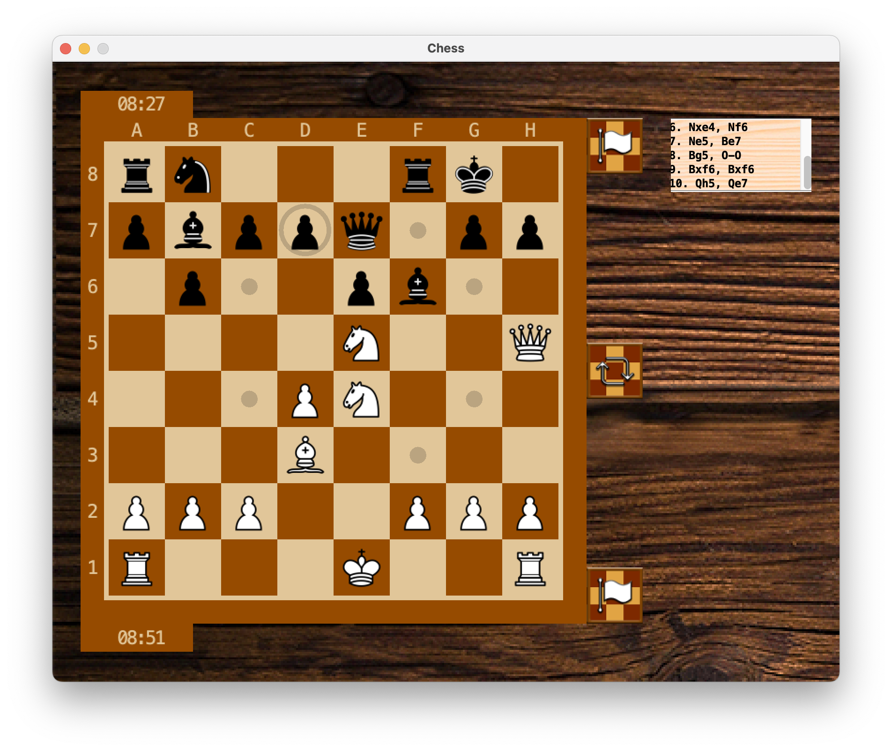

# Chess

  

A chess game developed as a Grade 11 computer science project—a fully playable chess game for two players, built with Java and AWT/Swing.

Enjoy classic chess with:

* Full support for all legal moves, including en passant
* Legal move highlighting
* A move log that tracks all moves made in the game
* Time tracking
* Customizable UI skins
* A board flip feature
* The option to resign



## Technologies
* Java 11
* AWT/Swing
* Gradle 7.4
## Authors
* Oleksandr Danchenko
* Parsa Hemmati
* Samuel Browne

## How to run
To run as gradle task:
```bash
./gradlew run
```
To generate .jar:
```bash
./gradlew jar
```
To execute .jar file:
```bash
java -jar Chess-1.0.jar
```